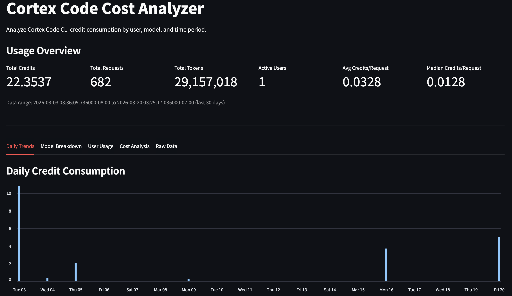

# Cortex Code Cost Analyzer



A Streamlit application for analyzing Snowflake Cortex Code CLI credit consumption. Track costs by user, model, token type, and time period with detailed breakdowns of input, output, cache read, and cache write tokens.

## Features

- **Usage Overview**: Total credits, requests, tokens, and active users at a glance
- **Daily Trends**: Credit consumption and request volume over time
- **Model Breakdown**: Per-model cost analysis with token-type granularity (input, cache read, cache write, output)
- **User Usage**: Credit consumption by user with per-request averages
- **Cost Analysis**: Statistical distribution (min, avg, median, P90, P95, P99, max) and derived pricing rates
- **Raw Data**: Request-level detail with granular token/credit breakdowns

## Prerequisites

- Snowflake account with Cortex Code CLI usage
- `ACCOUNTADMIN` role or granted access to `SNOWFLAKE.ACCOUNT_USAGE` schema
- Snowflake CLI (`snow`) installed and configured

## Quick Start

### 1. Clone the Repository

```bash
git clone https://github.com/LukasLohm/cortex-code-cost-analyzer.git
cd cortex-code-cost-analyzer
```

### 2. Create Snowflake Objects

```sql
CREATE DATABASE IF NOT EXISTS CORTEX_CODE_ANALYSIS;
CREATE SCHEMA IF NOT EXISTS CORTEX_CODE_ANALYSIS.APP;
```

### 3. Deploy

```bash
snow streamlit deploy --replace
```

### 4. Access

Navigate to **Projects > Streamlit > CORTEX_CODE_COST_ANALYZER** in Snowsight.

## Project Structure

| File | Purpose |
|------|---------|
| `streamlit_app.py` | Entry point — page config, sidebar, tab layout |
| `config.py` | Pricing constants, token type labels, page config |
| `data.py` | Cached query functions against `CORTEX_CODE_CLI_USAGE_HISTORY` |
| `render.py` | Tab rendering functions (charts, metrics, tables) |
| `utils.py` | Formatting helpers (`format_credits`, `format_tokens`, etc.) |
| `snowflake.yml` | Snowflake CLI deployment config |

## Data Source

All data comes from `SNOWFLAKE.ACCOUNT_USAGE.CORTEX_CODE_CLI_USAGE_HISTORY`.

Key columns:
- `TOKEN_CREDITS` / `TOKENS` — aggregate credit and token totals per request
- `TOKENS_GRANULAR` / `CREDITS_GRANULAR` — OBJECT columns with per-model, per-token-type breakdowns
- `USER_ID` — joined with `SNOWFLAKE.ACCOUNT_USAGE.USERS` for username resolution

**Latency**: Account usage views have up to 45-minute latency.

## Token Types

| Type | Description |
|------|-------------|
| **Input** | New tokens sent to the model |
| **Cache Read** | Tokens read from prompt cache (cheapest) |
| **Cache Write** | Tokens written to prompt cache |
| **Output** | Tokens generated by the model (most expensive) |

## Notes

- Cortex Code in Snowsight is until **1st of april 2026 free of charge** — only CLI usage appears in billing. This will likely change after 1st april 2026.
- Credits come pre-calculated from Snowflake; the app derives rates from actual `CREDITS_GRANULAR / TOKENS_GRANULAR` data
- `PARENT_REQUEST_ID` is always NULL, so the app aggregates by day/user/model rather than sessions
- All queries use `int()` casting on the lookback days parameter to prevent SQL injection

## License

MIT License - See [LICENSE](LICENSE) for details.

## Acknowledgments

- Built for analyzing [Snowflake Cortex Code](https://docs.snowflake.com/en/user-guide/cortex-code/cortex-code) CLI costs
- Pricing reference: [Snowflake Credit Consumption Table](https://www.snowflake.com/legal-files/CreditConsumptionTable.pdf)
- Uses [Streamlit](https://streamlit.io/) for the web interface
